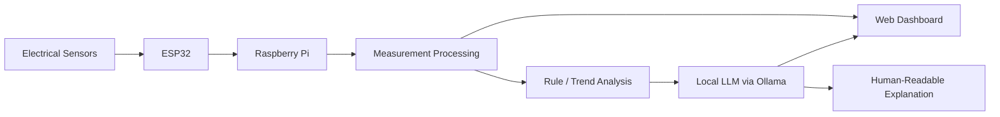

# Local LLM Energy Monitoring Agent — Raspberry Pi + ESP32

<p align="center">
  <strong>Edge AI + local LLM reasoning for electrical energy monitoring</strong>
</p>

<p align="center">
  
  
  
  
  <a href="https://github.com/shaiksadik1725-droid/energy-llm-ollama-agent-rpi-esp32/actions/workflows/python-syntax.yml"></a>
</p>

## Project at a Glance

| Item | Details |
|---|---|
| Domain | Edge AI / energy monitoring |
| Compute | Raspberry Pi + ESP32-oriented architecture |
| AI approach | Local LLM / Ollama-assisted interpretation |
| Interface | Browser dashboard |
| Communication | Serial / local networking workflow |
| Status | Academic engineering prototype |

## Overview

This project combines electrical measurements, a local Python monitoring agent, and a browser dashboard. The design is intended for edge deployment where measurements can be interpreted locally instead of depending entirely on cloud AI services.

## System Architecture



## Main Features

- Local electrical monitoring workflow
- Voltage/current/power-oriented analysis
- Browser dashboard
- Python monitoring agent
- Local LLM integration concept
- Warning and status generation
- Edge-oriented architecture

## Technology Stack

- Python
- Flask
- Flask-SocketIO
- Eventlet
- Requests
- PySerial
- HTML / CSS / JavaScript
- Ollama
- Raspberry Pi
- ESP32

## Repository Structure

```text
energy-llm-ollama-agent-rpi-esp32/
├── ollama_agent.py
├── dashboard.html
├── requirements.txt
└── .gitignore
```

## Setup

```bash
git clone https://github.com/shaiksadik1725-droid/energy-llm-ollama-agent-rpi-esp32.git
cd energy-llm-ollama-agent-rpi-esp32
pip install -r requirements.txt
```

Configure the local serial/network settings and Ollama endpoint used by the project, then run the Python agent.

## Why Local AI?

Local inference can reduce cloud dependence, support offline-oriented experiments, reduce data exposure, and enable lower-latency control or monitoring workflows.

## Engineering Considerations

Any AI-generated recommendation should remain separated from safety-critical electrical control. Device-control actions should use deterministic limits and explicit fail-safe logic.

## Future Work

- MQTT between ESP32 and Raspberry Pi
- Historical data storage
- Time-series charts
- Alert acknowledgement and audit logs
- Containerized deployment
- Stronger device-control safety boundaries
- Automated tests

## Author

**Sadik Shaik**

Computer Engineering · Edge AI · Embedded Systems
